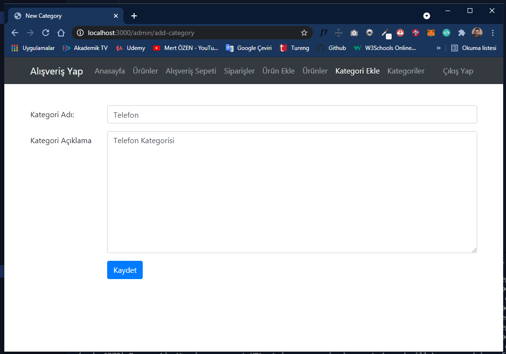

# NODEJS-FullStack

Bu repository üzerinde NodeJS ile yapmış olduğum FullStack çalışmalarıma ait dosyalara yer veriyorum.

## Bölüm Başlıkları

- Objects & Functions
- Next Generation:ES6/ES7+
- Javascript Module
- Asynchronous Programming & AJAX
- NodeJS
- NPM
- ExpressJS
- Templating Engine:PUG
- Working with Data:MVC
- SQL Database:MYSQL
- SQL ORM:Sequelize
- NoSQL Database: MongoDB
- NoSQL ORM:Mongoose
- Authentication
- Validation & Error Handling
- Application Improvements

# Basit E-Ticaret Sitesi
Bu uygulama iki rol üzerine kurgulanmış (müşteri ve yönetici) bir yapının olduğu basit e-ticaret sistemini referans almıştır. Yönetici kategorileri ve ürünleri düzenleme yetkisine sahiptir. Müşteri ise satışta olan ürünleri alışveriş sepetine ekleme ve sipariş verme yetkisine sahiptir. Daha fazla detayı aşağıda adım adım göreceksiniz.

## Kullanılan Teknolojiler ve Kütüphaneler
17-Final klasörünü indirdiğiniz zaman aşağıdaki teknolojilerin ve kütüphanelerin kullanıldığı bir yapı ile karşılacaksınız.

- Bootstrap (Front-End)
- NodeJS (Back-End) + ExpressJS (Back-End Web Framework)
- PUG (Template Engine)
- MongoDB (Mongoose ORM)
- MVC Design Pattern

## Uygulamayı Çalıştırma
Uygulamayı çalıştırabilmek için bilgisayarınızda **NodeJS** ve **MongoDB** kurulu olmalıdır. Bunları kurduktan sonra aşağıdaki adımları ve işlemleri takip edebilirsiniz. Benim bilgisayarımda NodeJS v14.15.3 versiyonu kurulu. Ayrıca MongoDB 4.4.5 ve MongoDB Compass 1.26.1 versiyonu kurulu. MongoDB için arayüz üzerinden kullanımı gerçekleştirebilmek için MongoDB Compass programınıda kurmayı unutmayın. MongoDB Kurulumu için  NodeJS-FullStack/12-NoSQL_Database-MongoDB/155-MongoDB_Setup/MongoDBSetup.png yolunu takip edebilirsiniz.

NodeJS Yükleme Adresi
>https://nodejs.org/en/

MongoDB Yükleme Adresi
>https://www.mongodb.com/try/download/community

> 17-Final klasörünü indirdikten sonra terminal penceresinde uygulamanın ana dizinindeyken **npm install** komutunu kullanmanız tüm ilişkili dosyaların indirilmesi için yeterli olacaktır. Ancak uygulamayı geliştirirken değişikliğin olduğu durumda tekrar tekrar yeniden başlatmamak için global olarak bilgisayarıma **nodemon** paketini kurduğumu bilmeniz gerekiyor. Bu nedenle **npm install -g nodemon** komutu ile kurulumu gerçekleştirmelisiniz.

> MongoDB üzerinde herhangi bir veritabanı oluşturma işlemi gerçekleştirmeniz gerek yok. Uygulamayı çalıştırdığınızda otomatik olarak gerekli alanlar oluşturulacaktır. Ancak **admin** kullanıcısını oluşturabilmek için uygulama çalıştırıldıktan sonra **Kaydol** menüsünden kayıt işlemini gerçekleştirdiğiniz kullanıcının *isAdmin:false* kısmını MongoDB Compass üzerinde *isAdmin:true* olarak güncellemeniz gerekecektir.

>Uygulamayı çalıştırmadan önce örnek ürün resimleri için **public/img** klasörünün altında bulunan slider resimleri haricindeki tüm resimleri klasörden kesip masaüstüne atın. Çünkü daha sonra ürün resimlerini eklerken bu resimleri seçeceğiz ve **public/img** klasörü altına otomatik olarak oluşturulacaktır.

> package.json dosyasını incelediğinizde bir **npm scripts** alanı göreceksiniz. Burada **start** anahtar kelimesinin karşılığında **nodemon app.js** kodu bulunmaktadır. Bu kod sayesinde uygulamayı geliştirirken app.js üzerinde veya bağlantılı dosyalarda yaptığınız değişikliklerde otomatik olarak değişiklikler geçerli kılınacaktır. Yani uygulamayı tekrar tekrar başlatmanıza gerek kalmayacaktır. Terminal penceresinde **npm start** komutunu yazıp çalıştırın.

>Tarayıcınızı açın ve **localhost:3000** yazın. Uygulamanın anasayfası karşınıza gelecektir. Artık bundan sonra yapmanız gereken ilk şey **Kaydol** kısmından yeni bir kullanıcı oluşturup MongoDB Compass üzerinde ilgili veritabanını yani **node-app** veritabanındaki **users** tablosunda bulunanan kullanıcının admin kısmını **true** yapmak olacaktır. Aşağıda görseller üzerinde bu işlemleri tek tek açıklıyor olacağım.

## Uygulama İşleyişi ve Kullanım Senaryosu
Yukarıda belirttiğim hususlara dikkat ederek kurulumları yaptığınız varsayarak aşağıda görsellerle destekleyerek devam edebiliriz.

Bağlantı cümleciğine dikkat ettiğimizde localhost üzerinde node-app veritabanı için geçerli bir bağlantı işleminin gerçekleştirildiğini görebilirisiniz. Ayrıca veritabanı oluşturma ve bağlantı kurma işlemlerinin tamamını **utility/database.js** içerisinde bulabilirsiniz.

Görselde de gösterildiği gibi uygulamanın ana dizinindeyken **npm start** komutunu çalıştırın. Eğer aşağıdaki gibi terminal penceresinde "connected to mongodb" şeklinde bir çıktı aldıysanız problem yok demektir.

MongoDB Compass üzerinde eğer aşağıdaki gibi **node-app** veritabanı oluşturulduysa herşey doğru çalışıyor demektir.

Şimdi sıra geldi tarayıcı üzerinden uygulamaya erişmeye bunun için **localhost:3000** yazmanız yeterli olacaktır. Çünkü app.js üzerinde de belirttiğimiz gibi 3000 portu dinlenmektedir.

Yukarıdaki görselde görüldüğü gibi uygulama 3000 portu üzerinde hizmet vermektedir. Burada herhangi bir ürün olmadığı için "Ürün Yok" mesajını alıyoruz. Öncelikle kullanıcı oluşturmalıyız. Kaydol düğmesine tıklayarak aşağıdaki sayfaya erişin. Kullanıcı bilgilerimizi mert@gmail.com ve 1234 olarak doldurdum.

Kayıt işlemi tamamlandıktan sonra localhost:3000/login sayfasına yönlendiriliyoruz. Şimdi veritabanına gidelim ve kullanıcımız için admin yetkisi verelim. (Veritabanını yenilemeniz gerekebilir.)

Kullanıcımız için yukarıdaki adımları takip ederek admin yetkisi verdikten sonra giriş yapabiliriz. Eğer normal bir kullanıcı ile giriş yapmış olsaydık ürünleri ekleyip güncellediğimiz menüleri göremeyecektik. Ayrıca url üzerinden de erişemeyecektik. Sadece sipariş verebilir konumda yani müşteri konumunda olacaktık.

Giriş işlemini gerçekleştirdikten sonra yukarıdaki ekran ile karşılaşacağız. Buradan **Kategori Ekle** menüsüne tıklayın ve birkaç kategori ekleyelim.

Telefon, Elektronik, Bilgisayar, Beyaz Eşya kategorilerini ekledikten sonra aşağıdaki gibi **Ürün Ekle** menüsü ile ürün ekleme bölümüne geçelim.

Ürünler için örnek görsellerimizi daha önce masaüstümüze almış ve public/img klasöründeki tüm ürün görsellerini kaldırmıştık. Şimdi ürünleri eklerken bu görsellerden faydalanabiliriz. Her eklediğimiz ürün için görseller tekrar oluşturulacaktır. Yani görseller her ürün için özel olacaktır. Ürün silinse bile görsel silinmeyecektir. Çünkü daha önce müşteriler bu ürünü sipariş etmiş olabilir ve sipariş tamamlanmışta olabilir. Bu görseller ürünlerle silinirse url bilgisinden görsele erişemeyiz. Ancak sipariş edilen ürünlerin bilgilerini **orders** tablosunda tuttuğumuz için problem olmayacaktır.

**Ürünler** menüsüne tıkladığımızda eklemiş olduğumuz ürünü görebilmekteyiz. Sol tarafta ise daha önce eklemiş olduğumuz kategorileri görüyoruz. Burada kategorilere göre filtreleme yapabilmekteyiz.

Birkaç ürün daha ekledikten sonra bir kullanıcı daha oluşturup **admin** yetkisi vermeden sisteme giriş yapalım. Zaten varsayılan olarak admin yetkisi false gelmektedir.

Müşteri girişi yaptığımız zaman yönetici için geçerli alanları göremiyoruz. Şimdi bir ürüne tıklayıp detay sayfasına gidebilirsiniz. Yönetici tarafında ürünlerin bilgilerini eklerken **CK Editor** kullandığımı belirtmek isterim. Bu sayede ürünlere özel tanıtım bilgilerini daha düzenli ve göze hitap edecek şekilde düzenleyebilmekteyiz. Herhangi bir ürünü sepete ekleyerek devam edelim.

Yukarıda da görüldüğü gibi ürünü sepete ekler eklemez alışveriş sepetine yönlendiriliyoruz. Burada senaryolar çok basite indirgenerek ele alındığı için kullanıcıyı hemen sepete yönlendirme yerine soru sorulabilir. Ancak hızlı öğrenmeye yönelik geliştirilen bir uygulama olduğu için detaylarda boğulmak doğru olmayacaktır. **Alışverişi Tamamla** diyerek siparişler bölümüne geçebiliriz.

Daha öncede ifade ettiğim gibi sipariş edilen ürünlerin silinmemesi gerektiği için burada ürünleri yönetici silse bile resimleri silinmemektedir. Kullanıcı sipariş ettiği ürünlerin fiyatını, sipariş tarihini vs. görüntüleyebilmektedir.

> Temel olarak uygulama kullanım senaryosu bu kadar. Tabi silme, güncelleme gibi işlemleri kendinizde deneyebilirsiniz. Ayrıca formların boş geçilmesi gibi durumlar ele alınmıştır. Hatta olmayan sayfalar içinde **404** sayfası hatalı işlemler için **500** sayfası oluşturulmuştur. Tabi erişim yetkisinin olmadığı sayfalar için anasayfaya yönlendirme işlemleri gerçekleştirilmiştir.

> Kullanıcılara ait şifreler **hash** işleminden geçirilerek veritabanında saklanmaktadır. Bu işlem için **bcrypt** paketi kullanılmıştır.

> Session işlemleri için **express-session** ve **cookie-parser** paketleri kullanılmıştır. Bu sayede kullanıcılar tarayıcılarını kapatsalar bile sürekli olarak giriş yapmak zorunda kalmayacaktır. Buradaki session bilgisini kullanıcı tarayıcısının yanı sıra veritabanında saklayarak olası bir session saldırısını önlemek için **csurf** paketinden faydalanılmıştır. Kısacası istekler tokenize işleminden geçirilmektedir. Kullanıcının göndermiş olduğu tüm formlarda gizli bir input ile bu token bilgisi talep edilmektedir.

> Resim gönderme yani sunucuya kaydetme işlemi için **multer** paketi kullanılmıştır.

> Form doğrulama  işlemleri için **validator** paketi kullanılmıştır.